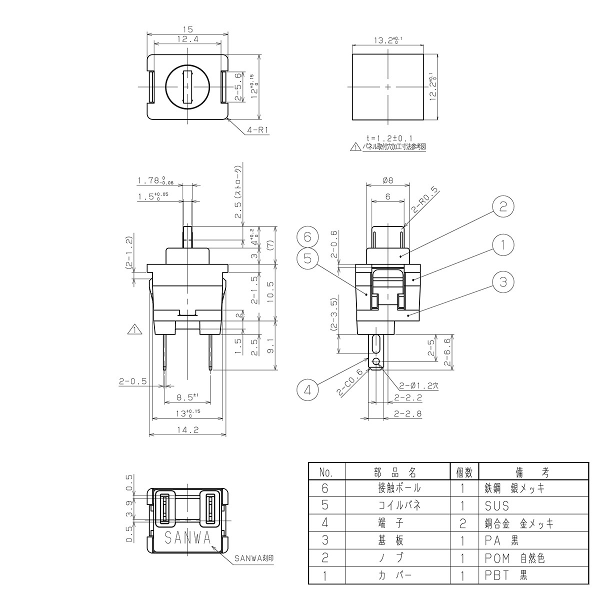
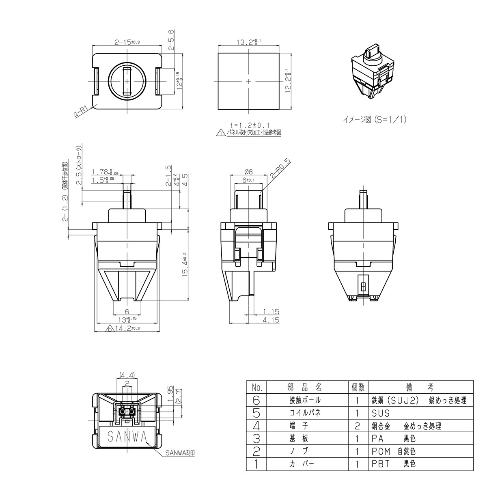
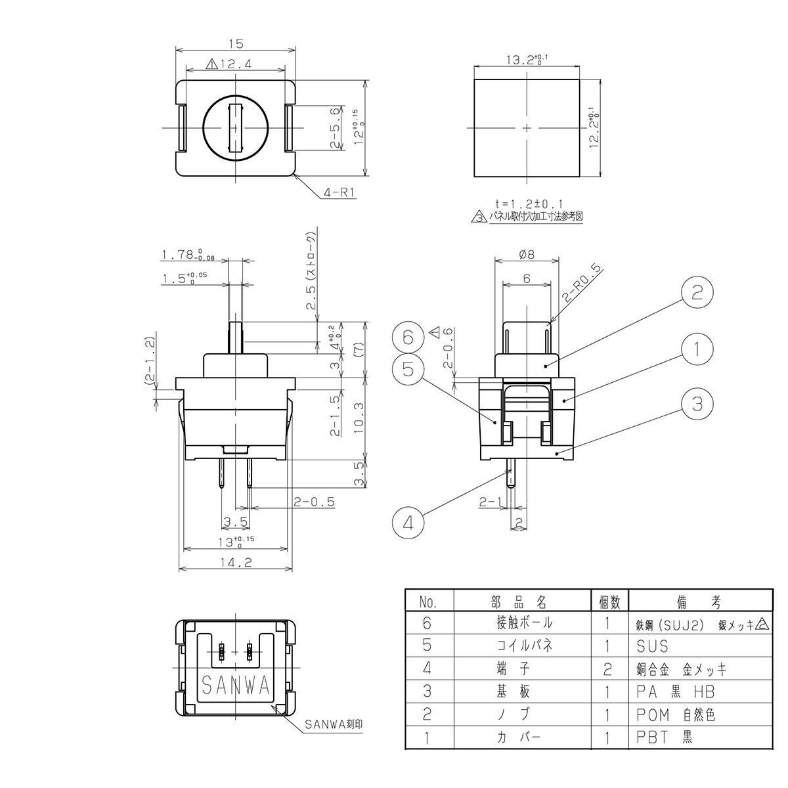
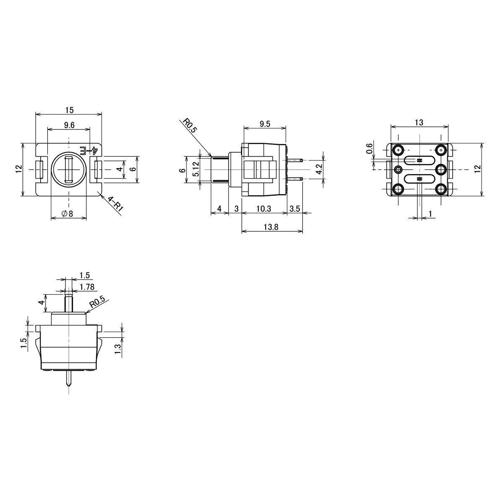
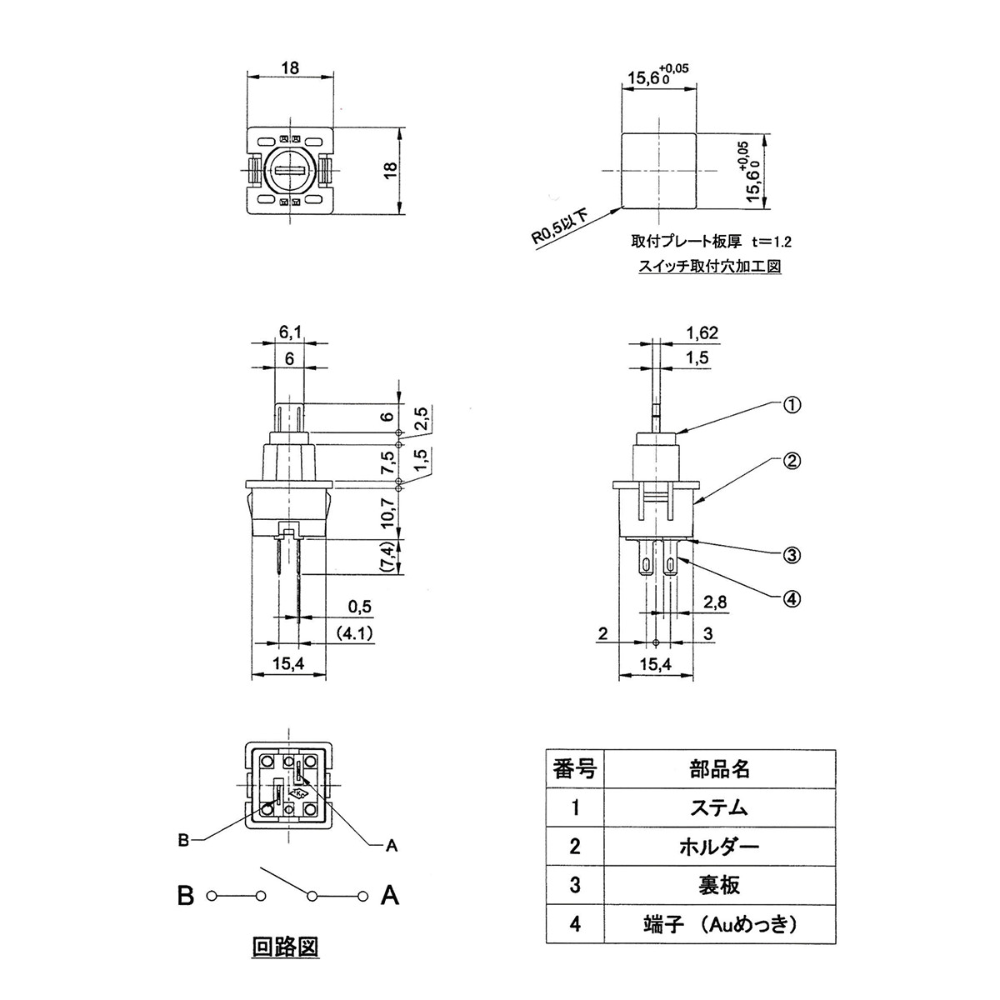

# Arcade switches references

#### Table of contents
- [Arcade switches references](#arcade-switches-references)
      - [Table of contents](#table-of-contents)
  - [Types of switches](#types-of-switches)
    - [Sanwa SW-68](#sanwa-sw-68)
    - [Sanwa SW-68CAU](#sanwa-sw-68cau)
    - [Sanwa SW-68CAU2](#sanwa-sw-68cau2)
    - [Sanwa SW-68BAU](#sanwa-sw-68bau)
    - [Seimitsu MM9-2](#seimitsu-mm9-2)
    - [Seimitsu MM9-3-AU](#seimitsu-mm9-3-au)
    - [Seimitsu MM9-4-AU](#seimitsu-mm9-4-au)
  - [Board design info](#board-design-info)

## Types of switches

### Sanwa SW-68

* Most popular and available variant
* 2.8mm lug connector x2 (#110タブ)
* Engineering drawing source: [【三和電子】 押しボタン用スイッチ 【SW-68】 / 【SANWA】 Switch for Push Button 【SW-68】 / アーケードゲーム販売トップス](https://www.tops-game.jp/products/detail.php?product_id=2652)

### Sanwa SW-68CAU

* Female 2pin connector on the switch

* Engineering drawing source: [【三和電子】 専用コネクタ接続タイプ 押しボタン用 キースイッチ 【SW-68CAU】 / 【SANWA】 Key Switch for Dedicated Connector Connection Type Push Button 【SW-68CAU】 / アーケードゲーム販売トップス](https://www.tops-game.jp/products/detail.php?product_id=5684)

### Sanwa SW-68CAU2

* Footprint same as CAU variant

* "Repulsive force enhanced", probably means requiring more actuation force

* Engineering drawing source: [【三和電子】 専用コネクタ接続タイプ 押しボタン用 キースイッチ(反発力強化タイプ) 【SW-68CAU2】 / 【SANWA】 Key Switch for Dedicated Connector Connection Type Push Button (Repulsive force enhanced type) 【SW-68CAU2】 / アーケードゲーム販売トップス](https://www.tops-game.jp/products/detail.php?product_id=6353)

### Sanwa SW-68BAU

* Male 2pin connector on the switch

* "Board mount", the connector is more suitable for soldering directly onto a PCB

* Engineering drawing source: [【三和電子】 押しボタン用 スイッチ (基板実装端子型) 【SW-68BAU】 / 【SANWA】 Key Switch for Push Button (Board mounting type) 【SW-68BAU】 / アーケードゲーム販売トップス](https://www.tops-game.jp/products/detail.php?product_id=4607)

------

### Seimitsu MM9-2

- Male 2pin connector on the switch

- "Board mount", the connector is more suitable for soldering directly onto a PCB

- Engineering drawing source: [【セイミツ工業】 押しボタン用 スイッチ (基板実装端子型) 【MM9-2】 / 【SEIMITSU】 Key Switch for Push Button (Board mounting type) 【MM9-2】 / アーケードゲーム販売トップス](https://www.tops-game.jp/products/detail.php?product_id=6275)

### Seimitsu MM9-3-AU

* For 24mm arcade buttons

* 2.8mm lug connector x2

* offset terminals, not the same connector footprint as Sanwa

* Engineering drawing source: [【セイミツ工業】 押しボタン用スイッチ 【MM9-3-AU】 / 【SEIMITSU】 Switch for Push Button 【MM9-3-AU】 / アーケードゲーム販売トップス](https://www.tops-game.jp/products/detail.php?product_id=5995)

### Seimitsu MM9-4-AU

* For 30mm arcade buttons

* Same connector footprint as MM9-4-AU but larger physical size

* Engineering drawing source: [【セイミツ工業】 押しボタン用スイッチ 【MM9-4-AU】 / 【SEIMITSU】 Switch for Push Button 【MM9-4-AU】 / アーケードゲーム販売トップス](https://www.tops-game.jp/products/detail.php?product_id=5996)

------

## Board design info

- Recommended top plate thickness: 1.2mm

- SW-68 top plate standoff height: 11.5mm - top plate thickness (1.2mm)

- SW-68BAU top plate standoff height: 8.8mm - top plate thickness (1.2mm)

- MM9-2 top plate standoff height: 8.8mm - top plate thickness (1.3mm)

- MM9-3-AU / MM9-4-AU top plate standoff height: 10.7mm - top plate thickness (1.3mm)